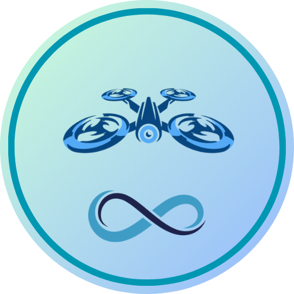
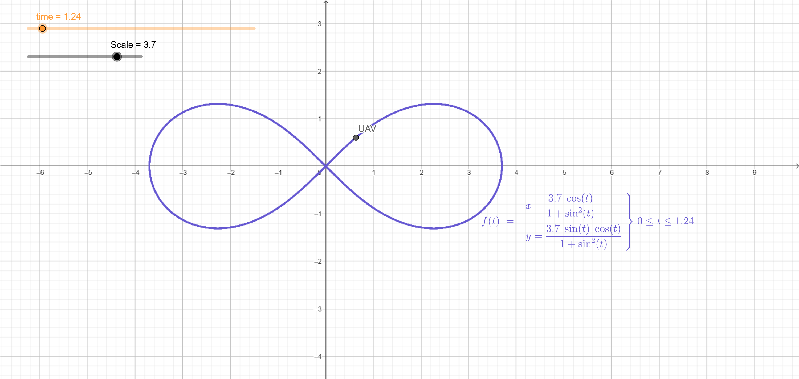

<!--
MARKDOWN IMAGES & BADGES
* https://www.markdownguide.org/basic-syntax/#reference-style-links
* https://github.com/Ileriayo/markdown-badges

EMOJIS
* https://gist.github.com/rxaviers/7360908

Find and replace the following text with the name of the project:
	flight-8-path
-->

<div align="center" id="readme-top">



<!-- omit in toc -->

# MRS Flight Path: Figure-8 Pattern

<!-- An awesome README description! -->

Simple example of a drone flying in the shape of a figure 8. This project is the solution to the technical task for the position of a Software Engineer at MRS. I hope it can be added to the list of examples for the MRS project.

[View Demo](https://github.com/cychitivav/flight-8-path) · [Report Bug](https://github.com/cychitivav/flight-8-path/issues) · [Request Feature](https://github.com/cychitivav/flight-8-path/issues)

[](https://github.com/cychitivav/flight-8-path/graphs/contributors)
[](https://github.com/cychitivav/flight-8-path/network/members)
[](https://github.com/cychitivav/flight-8-path/stargazers)
[](https://github.com/cychitivav/flight-8-path/issues)
[](https://github.com/cychitivav/flight-8-path/blob/main/LICENSE)

</div>

<!-- TABLE OF CONTENTS -->
<!-- omit in toc -->

## :pencil:Table of contents

-   [:pushpin:About The Project](#pushpinabout-the-project)
    -   [Built With](#built-with)
-   [:checkered_flag:Getting Started](#checkered_flaggetting-started)
    -   [Prerequisites](#prerequisites)
    -   [Installation](#installation)
-   [:balloon:Usage](#balloonusage)
-   [:roller_coaster:Roadmap](#roller_coasterroadmap)
-   [:busts_in_silhouette:Contributing](#busts_in_silhouettecontributing)
-   [:key:License](#keylicense)
-   [:pencil2:Authors](#pencil2authors)
-   [:tada:Acknowledgments](#tadaacknowledgments)

<!-- ABOUT THE PROJECT -->

## :pushpin:About The Project

[](https://user-images.githubusercontent.com/30635659/169600958-763d1628-b7bb-475c-a8bc-56120d1d3ff9.svg)

Here's a blank template to get started: To avoid retyping too much info. Do a search and replace with your text editor `flight-8-path`

<div align="right">

[:arrow_double_up:back to top](#readme-top)

</div>

<!-- BADGES
https://github.com/Ileriayo/markdown-badges -->

### Built With

-   [](ros.org)
-   

<div align="right">

[:arrow_double_up:back to top](#readme-top)

</div>

<!-- GETTING STARTED -->

## :checkered_flag:Getting Started

This is an example of how you may give instructions on setting up your project.

### Installation

1. Clone the repo
    ```sh
    git clone https://github.com/cychitivav/flight-8-path.git
    ```

#### Docker

2. Build the Docker image
   `sh
docker build -t flight-8-path:latest -f ./.devcontainer/Dockerfile .
`
3. Run the Docker container
   `sh
./cli/run.sh
`

> [!NOTE]
> If you need to open other terminals, you can use the following command:
>
> ```sh
> docker exec -it flight-8-path bash
> ```

#### Manual

If you are using Ubuntu 20.04, you can install ROS Noetic and the MRS system by following the steps below:

2. Install ROS

    ```sh
    sudo apt-get install ros-noetic-desktop-full
    ```

3. Install MRS system

    ```sh
    curl https://ctu-mrs.github.io/ppa-stable/add_ppa.sh | bash
    sudo apt install ros-noetic-mrs-uav-system-full -y
    ```

4. Move the project to the `src` folder of the MRS workspace
    ```sh
    mv flight-8-path ~/catkin_ws/src
    ```

#### GitHub Codespaces

If you are using GitHub Codespaces, you can use the following steps:

2. Open the GitHub Codespaces (yes, it's that simple!)

Finally, build the project

```sh
catkin build
```

> [!NOTE]
> Perhaps you will get a warning about the `rosdep`, so you can run the following command:
>
> ```sh
> rosdep update
> ```

<!-- USAGE EXAMPLES -->

## :balloon:Usage

Use this space to show useful examples of how a project can be used. Additional screenshots, code examples and demos work well in this space. You may also link to more resources.

> **Note**: For more examples, please refer to the* [*Documentation\*](https://github.com/cychitivav/flight-8-path/wiki)

<!-- ROADMAP -->

## :roller_coaster:Roadmap

-   [x] Dockerize the project - Initially, the project will be dockerized with the [MRS Docker](https://github.com/ctu-mrs/mrs_docker) environment but later on, it will be dockerized with a custom Dockerfile because the MRS Docker environment has too many layers and GitHub Codespaces does not support more than 125 layers.
-   [x] Catkin init and create a package

```sh
	catkin init
	catkin create pkg <package_name> --catkin-deps <dependencies>
```

-   [x] Create a tmux session file
-   [x] Configure nodelet manager
-   [x] Compute the parametric equation of the figure 8
        

$$
\begin{align*}
  x(t) &= \frac{\text{scale}\cdot\cos(t)}{1+\sin^2(t)} \\
  y(t) &= \frac{\text{scale}\cdot\sin(t)\cos(t)}{1+\sin^2(t)} \\
  z(t) &= \text{scale}
\end{align*}
$$

-   [x] Create a node that publishes the figure 8 path to `/${UAV_NAME}/trajectory_generation/path`
-   [x] Create a launch file

> **Note**: See the [open issues](https://github.com/cychitivav/repo_name/issues) for a full list of proposed features (and known issues).

<div align="right">

[:arrow_double_up:back to top](#readme-top)

</div>

<!-- CONTRIBUTING -->

## :busts_in_silhouette:Contributing

Contributions are what make the open source community such an amazing place to learn, inspire, and create. Any contributions you make are **greatly appreciated**.

If you have a suggestion that would make this better, please fork the repo and create a pull request. You can also simply open an issue with the tag "enhancement".
Don't forget to give the project a star! Thanks again!

1. Fork the Project
2. Create your Feature Branch (`git checkout -b feature/AmazingFeature`)
3. Commit your Changes (`git commit -m 'Add some AmazingFeature'`)
4. Push to the Branch (`git push origin feature/AmazingFeature`)
5. Open a Pull Request

<div align="right">

[:arrow_double_up:back to top](#readme-top)

</div>

<!-- LICENSE -->

## :key:License

Distributed under the MIT License. See [`LICENSE`](LICENSE) for more information.

<div align="right">

[:arrow_double_up:back to top](#readme-top)

</div>
